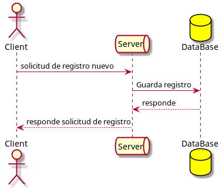

[](https://opensource.org/licenses/MIT)
[](https://www.codacy.com/manual/fguaman/example-global-logic?utm_source=github.com&amp;utm_medium=referral&amp;utm_content=fguaman/example-global-logic&amp;utm_campaign=Badge_Grade)
# Example GLobalLogic
Proyecto ejemplo para postulación a Global Logic.

## Diagrama 


# Evaluación: JAVA

Desarrolle una aplicación que exponga una API RESTful de creación de usuarios.

# ESTADO

App en desarrollo, no incluye pruebas unitarias
# INDICACIONES DE USO
Se incluye en documentos coleccion completa postman para invocar la app, por defecto en port 8083

 > El primero que debe ejecutar es http://localhost:8083/user?user=usr&password=xxxx, que retorna token que debe ser agregado a el parametro Authorization en el header de cada metodo
 > Cada metodo recibe un jSon en el body   

# INSTALACION
***
```
$ git clone https://github.com/elyakan/globalLogic.git
$ cd ../path/to/the/file
$ npm install
$ npm start


